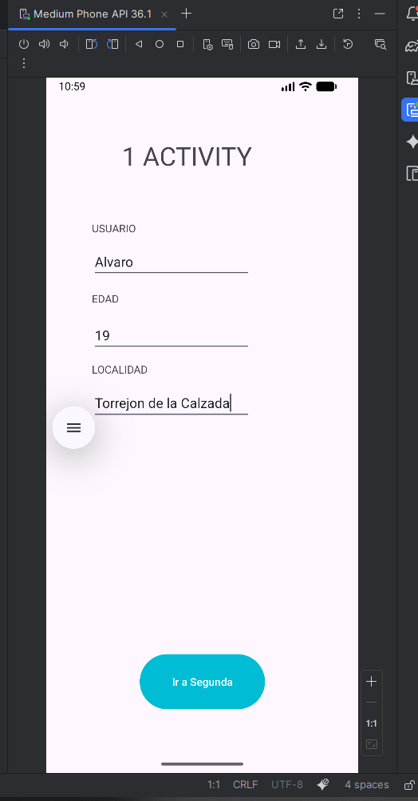
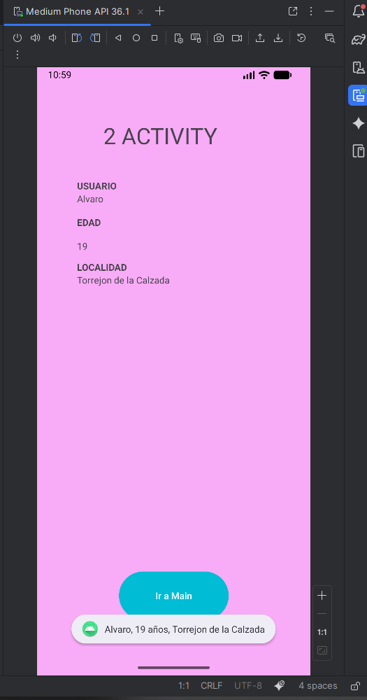

# Comunicación entre Actividades – Android

Ejemplo sencillo que muestra cómo pasar datos entre dos actividades de Android usando un Intent explícito y extras (putExtra / getExtras).

---

## Vista previa

Primera pantalla (formulario):



Segunda pantalla (datos recibidos):



---

## Descripción general

La app contiene dos pantallas:

- `MainActivity`: formulario con campos Nombre, Edad y Localidad. Valida que no estén vacíos y crea un `Intent` para abrir `SegundaActivity` pasando los valores como extras.
- `SegundaActivity`: recibe los extras del `Intent` y los muestra en varios `TextView`. También muestra un `Toast` con la información y ofrece un botón para volver.

## Código esencial

En `MainActivity` se recogen y validan los datos, se construye el Intent y se inicia la siguiente actividad:

```kotlin
val intent = Intent(this, SegundaActivity::class.java)
intent.putExtra("id", nombre)
intent.putExtra("edad", edad)
intent.putExtra("localidad", localidad)
startActivity(intent)
```

En `SegundaActivity` se leen los valores enviados:

```kotlin
val nombre = intent.extras?.getString("id")
val edad = intent.extras?.getInt("edad")
val localidad = intent.extras?.getString("localidad")
```

Y se asignan a los `TextView` correspondientes.

## Archivos importantes

- `app/src/main/res/layout/activity_main.xml` — layout del formulario.
- `app/src/main/res/layout/activity_segunda.xml` — layout de la segunda pantalla.
- `app/src/main/java/.../MainActivity.kt` — lógica de validación y envío de extras.
- `app/src/main/java/.../SegundaActivity.kt` — lógica de recepción y renderizado de datos.

## Cómo ejecutar

1. Abre el proyecto en Android Studio.
2. Conecta un dispositivo o ejecuta un emulador.
3. Ejecuta la app (`Run` / `Shift+F10`).
4. En la primera pantalla, completa Nombre, Edad y Localidad y pulsa "Ir a Segunda".
5. Comprueba que la segunda pantalla muestra los valores y el Toast.

## Buenas prácticas y mejoras sugeridas

- Usar constantes para las claves de los extras, por ejemplo:

```kotlin
companion object {
	const val EXTRA_NOMBRE = "xyz.balbe.actividades.EXTRA_NOMBRE"
}
```

- Manejar la conversión a Int con control de errores (`toIntOrNull`) para evitar excepciones si el usuario introduce texto no numérico.
- Usar `TextInputLayout` para mostrar errores inline en los campos de entrada.
- Para pasar objetos complejos entre actividades, implementar `Parcelable` en lugar de múltiples extras.
- En la segunda actividad, para volver al original es preferible usar `finish()` en lugar de lanzar otra instancia de `MainActivity`.